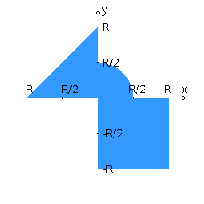

# Лабораторная работа 4

## Вариант `14`

> I had a problem, so I thought to use Java.
> 
> Now I have a `ProblemFactory`

 \

 \

|.pdf|.docx|
|-|-|
| [report](./docs/report.pdf) | [report](./docs/report.docx) |

Переписать приложение из [предыдущей лабораторной работы](https://se.ifmo.ru/courses/web#lab3) с использованием следующих технологий:

- Уровень **back-end** должен быть основан на [Spring](https://spring.io/).
- Уровень **front-end** должен быть построен на [Vue.js](https://vuejs.org/) с использованием обычных полей ввода HTML
- Взаимодействие между уровнями **back-end** и **front-end** должно быть организовано посредством **REST API**.

Приложение по-прежнему должно включать в себя 2 страницы - _стартовую_ и _основную_ страницу приложения. Обе страницы приложения должны быть адаптированы для отображения в 3 режимах:
- **"Десктопный"** - для устройств, ширина экрана которых равна или превышает **1210** пикселей.
- **"Планшетный"** - для устройств, ширина экрана которых равна или превышает **773**, но меньше **1210** пикселей.
- **"Мобильный"**- для устройств, ширина экрана которых меньше **773** пикселей.

### Дополнительное задание:

1. При регистрации и входе в аккаунт отправлять пользователю письмо на почту (**JavaMail**).
2. Переписать REST сервис в **SOAP** сервис.

### Стартовая страница должна содержать следующие элементы:

- "**Шапку**", содержащую ФИО студента, номер группы и номер варианта.
- **Форму для ввода логина и пароля**. Информация о зарегистрированных в системе пользователях должна храниться в отдельной таблице БД (пароль должен храниться в виде хэш-суммы). Доступ неавторизованных пользователей к основной странице приложения должен быть запрещён.

### Основная страница приложения должна содержать следующие элементы:

- Набор полей ввода для задания координат точки и радиуса области в соответствии с вариантом задания: `Radio {'-4','-3','-2','-1','0','1','2','3','4'}` для координаты по **оси X**, `Text (-5 ... 5)` для координаты по **оси Y**, и `Radio {'-4','-3','-2','-1','0','1','2','3','4'}` для задания **радиуса области**. Если поле ввода допускает ввод заведомо некорректных данных (таких, например, как буквы в координатах точки или отрицательный радиус), то приложение должно осуществлять их _валидацию_.
- **Динамически обновляемую картинку**, изображающую область на координатной плоскости в соответствии с номером варианта и точки, координаты которых были заданы пользователем. Клик по картинке должен инициировать сценарий, осуществляющий определение координат новой точки и отправку их на сервер для проверки её попадания в область. Цвет точек должен зависить от факта попадания / непопадания в область. Смена радиуса также должна инициировать перерисовку картинки.
- **Таблицу** со списком результатов предыдущих проверок.
- Ссылку, по которой аутентифицированный пользователь может **закрыть свою сессию** и вернуться на стартовую страницу приложения.

### Дополнительные требования к приложению:

- Все результаты проверки должны сохраняться в базе данных под управлением СУБД `Oracle`.
- Для **доступа к БД** необходимо использовать `Spring Data`.

### Вопросы к защите лабораторной работы:

**Ответы**: [*новые*](https://github.com/EgorMIt/ITMO/blob/master/2%20-%20%D0%92%D0%B5%D0%B1-%D0%9F%D1%80%D0%BE%D0%B3%D1%80%D0%B0%D0%BC%D0%BC%D0%B8%D1%80%D0%BE%D0%B2%D0%B0%D0%BD%D0%B8%D0%B5/Lab4.md) и [*старые*](https://github.com/AppLoidx/Web-Development-Cheats/blob/master/itmo-university/labs/Lab4.md)

1. Платформа `Java EE`. Спецификации и их реализации.
2. Принципы `IoC`, `CDI` и `Location Transpanency`. Компоненты и контейнеры.
3. Управление жизненным циклом компонентов. Дескрипторы развёртывания.
4. `Java EE API`. Виды компонентов. Профили платформы `Java EE`.
5. Компоненты `EJB`. `Stateless` & `Stateful` `Session Beans`. `EJB Lite` и `EJB Full`.
6. Работа с электронной почтой в `Java EE`. `JavaMail API`.
7. `JMS`. Реализация очередей сообщений. Способы доставки сообщений до клиента. `Message-Driven Beans`.
8. Понятие транзакции. Управление транзакциями в `Java EE`. `JTA`.
9. Веб-сервисы. Технологии `JAX-RS` и `JAX-WS`.
10. Платформа `Spring`. Сходства и отличия с `Java EE`.
11. Модули `Spring`. Архитектура `Spring Runtime`. `Spring Security` и `Spring Data`.
12. Реализация `IoC` и `CDI` в `Spring`. Сходства и отличия с `Java EE`.
13. Реализация `REST API` в `Java EE` и `Spring`.
14. `React JS.` Архитектура и основные принципы разработки приложений.
15. Компоненты `React`. `State` & `props`. "Умные" и "глупые" компоненты.
16. Разметка страниц в `React`-приложениях. `JSX`.
17. Навигация в `React`-приложениях. `ReactRouter`.
18. Управление состоянием интерфейса. `Redux`.
19. `Angular`: архитектура и основные принципы разработки приложений.
20. `Angular`: модули, компоненты, сервисы и `DI`.
21. `Angular`: шаблоны страниц, жизненный цикл компонентов, подключение `CSS`.
22. `Angular`: клиент-серверное взаимодействие, создание, отправка и валидация данных форм.

### Как запустить?

Экспорт переменных окружения:

    export $(cat .env | xargs)

База данных:

    docker compose up

Запуск **back-end**:

    ./gradlew genJaxb
    ./gradlew bootRun

Запуск **front-end**:

    cd frontend
    npm run dev

## Лицензия 

Проект доступен с открытым исходным кодом на условиях [Лицензии MIT](https://opensource.org/licenses/MIT).
*Авторские права 2023 Max Barsukov*

**Поставьте звезду :star:, если вы нашли этот проект полезным.**
